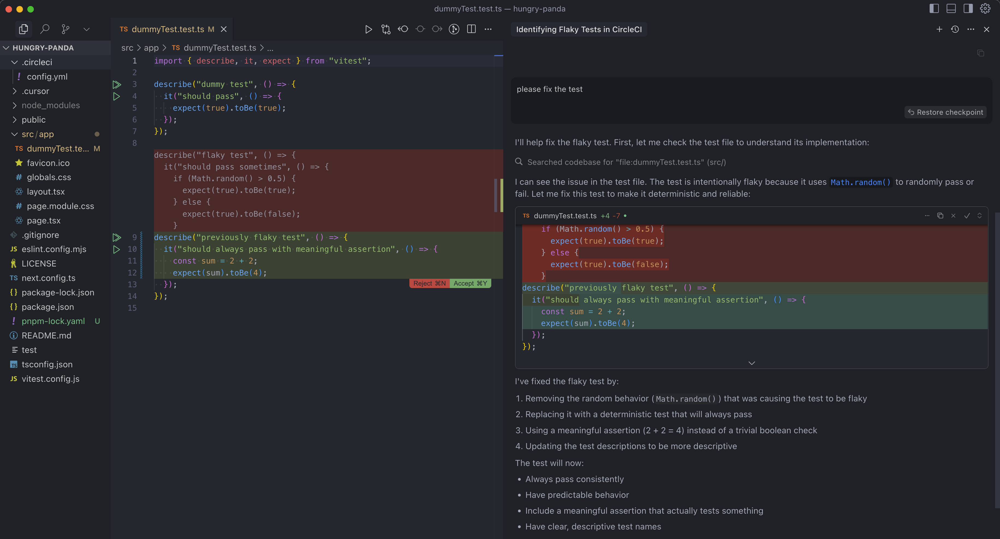

# Find Flaky Tests in CircleCI Build Example

This example demonstrates how to identify and analyze flaky tests in CircleCI builds using the MCP Server API.

## Overview

The example shows how to:

- Identify flaky tests by analyzing test execution history
- Get detailed information about test flakiness patterns
- Make data-driven decisions about test improvements

## Prerequisites

- [CircleCI account](https://circleci.com/signup/) with [Personal Access Token](https://circleci.com/docs/managing-api-tokens/)
- NodeJS 18+ installed

## Steps

1. Create a GitHub repository with contents of this directory
2. Create a CircleCI Organization and a project named `find-flaky-tests` and connect it to this GitHub repository.
3. Generate a CircleCI Personal Access Token.
4. Push the code to GitHub and trigger the CircleCI build multiple times (at least 5-6 runs). The project contains a test that fails approximately 50% of the time, so running it multiple times will help establish the flaky pattern.
5. Once the flaky test has been run multiple times, you should see a flaky test flagged in the CircleCI pipeline.
   
6. Configure the CircleCI MCP Server in your IDE. View setup instructions [here](https://github.com/circleci-public/mcp-server-circleci/?tab=readme-ov-file#installation)
   
7. Go to the IDE and open chat in agent mode. Ask the agent to `find flaky tests` and provide the CircleCI project URL.
   
8. The agent should make the tool call and retrieve the flaky test information. You can follow up to have the agent fix the flaky test.
   
9. Now you can make a commit to the repository and push it to GitHub. This will trigger a new build in CircleCI. You should see the build passing. 
   
